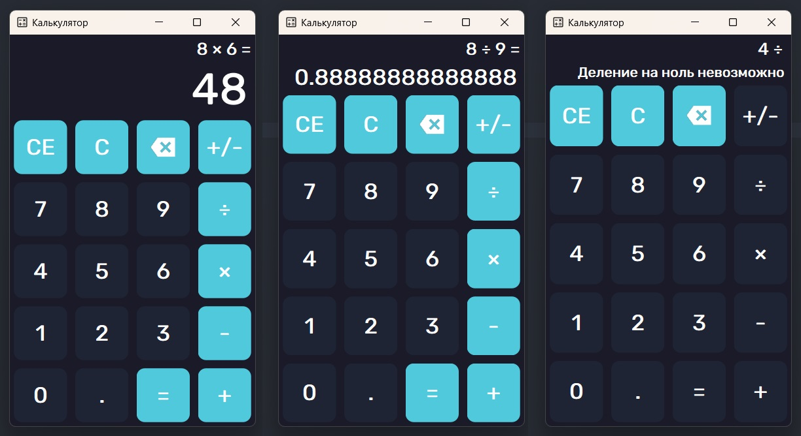

Graphing calculator using PySide6 framework
 ===
Welcome to the Graphing Calculator project repository! Here you will find the source code and resources for building a simple yet powerful GUI calculator developed using the PySide6 framework.

About the project
===
Graphing Calculator is an application that provides a convenient and efficient way to perform mathematical calculations. It is a handy tool that allows users to perform basic arithmetic operations such as addition, subtraction, multiplication and division.

Peculiarities
===
1. Simple and clear user interface.
2. Ability to perform basic arithmetic operations.
3. Support for decimal numbers and calculations.
4. Convenient "Clear" button to reset the entered values.
5. Automatic update of the result when using the input data.

Technologies and tools
===
The project was developed using the following technologies and tools:
1. Python: The programming language in which the calculator is written.
2. PySide6: A powerful framework for creating graphical interfaces in Python.
3. Git: A version control system for easily merging changes and collaborating on a project.

Installation and launch
===
1. Make sure you have Python version 3 or higher installed.
2. Clone the repository on your local computer with the command: git clone https://github.com/korniloffns/calculator.git.
3. Change to the project directory: Calculator CD.
4. Install the appropriate dependency using the command: pip install -r requirements.txt.
5. Run the calculator with the command: python main.py.
